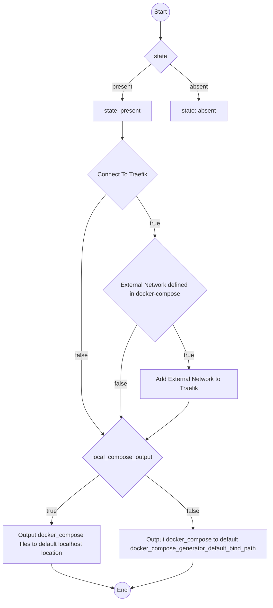
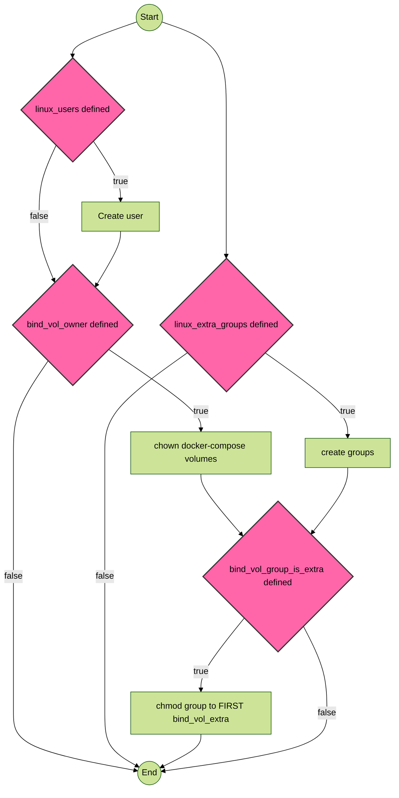
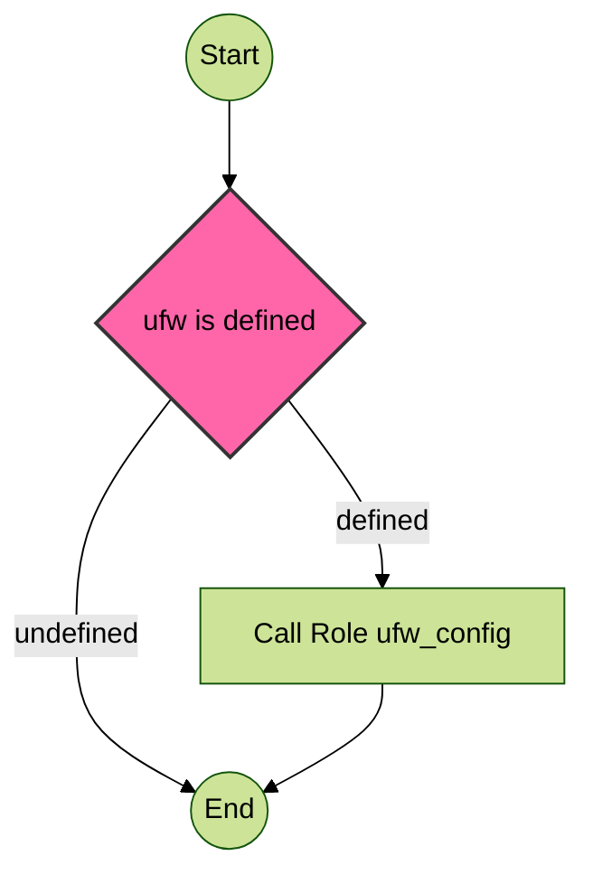

# Docker Apps

This folder contains docker apps to be used with role `docker_compose_generator`

## Docker app sample structure for app `grafana`

``` bash
├── docker-compose.yaml.j2 # mandatory
├── grafana # if folder matches app name, this child structure will be copied to docker host
│   └── config.alloy.j2
└── grafana-vars.yaml # optional
```

# {docker-app-name}-vars.yaml

The role `docker_compose_generator` will leverage the -vars file to control some resource creation. Here is an overview of keys and outcomes.

Expected keys:

| Key                 | Type  | Example        | Expected Value    | Outcome |
|---------------------|-------|----------------|-------------------|---------|
| state               | string| present        | [present, absent] | create/delete configs |
| connect_to_traefik  | bool  | true           | [True, False] | connect external networks to traefik |
| local_compose_output| bool  | true           | [True, False] | output docker_compose file on ansible controller instead of remote host |
| linux_users         | map   | {name: plex}   | map with keys: name,comment,shell | create specific users |
| linux_extra_groups      | list  |  ["media"]  | Standalone Groups | Create linux groups |
| bind_vol_owner      | string   | plex   | valid user name | override root as default owner for `dict` bind volumes |
| bind_vol_group_is_extra | bool | true | [True, False]  | override root as default group for `dict` bind volumes |
| ufw      | list(map)   |  {rule: allow, proto: tcp[...]}  | `ufw_config` role inputs | Manage app-specific UFW rules |
| backup_volumes      | list(string)   |  ["path/to/volume"]  | Specific Docker Volume paths | Adds a cron job to backup these volumes |

### xyz-vars.yaml variables and outcomes for `local_compose_output` and `connect_to_traefik`




### xyz-vars.yaml variables and outcomes for `linux_users`


### xyz-vars.yaml variables and outcomes for `ufw`

